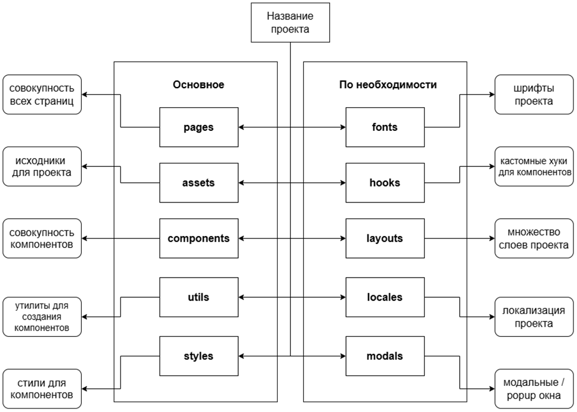
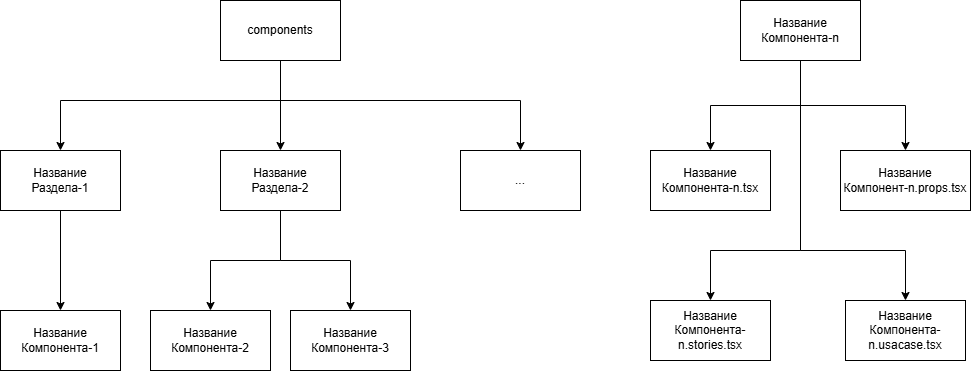
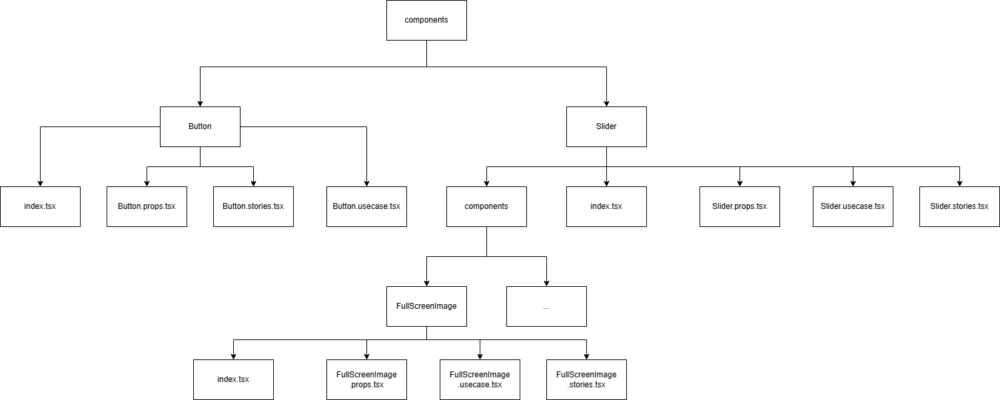

# ` О структуре проекта`

## __Один из  шаблонов проекта (корректируетя по необходимости)__

#### __Пояснение__
- __pages__: В ней лежат уже готовые страницы
 (т.e < PageLayout>{children}< /PageLayout>)

- __assets__: В ней лежат исходники проекта.
Как минимум в ней создается папка icons.

- __components__: В ней лежат компоненты.

- __utils__: В ней лежат утилиты (например вспомогательный функции)

- __styles__: В ней лежат стили компонентов .styles файлы

- __fonts__: В ней лежат шрифты

- __hooks__: В ней лежат кастомные хуки.

- __layouts__: В ней лежат обертки для компонентов (страниц).

- __locales__:В ней лежит локализация на разные языки.

- __modals__: В ней лежат модалки (можно не отделять от комопнентов при желании)
-------
## __Предполагаемая структура компонента__

## __Пример__

